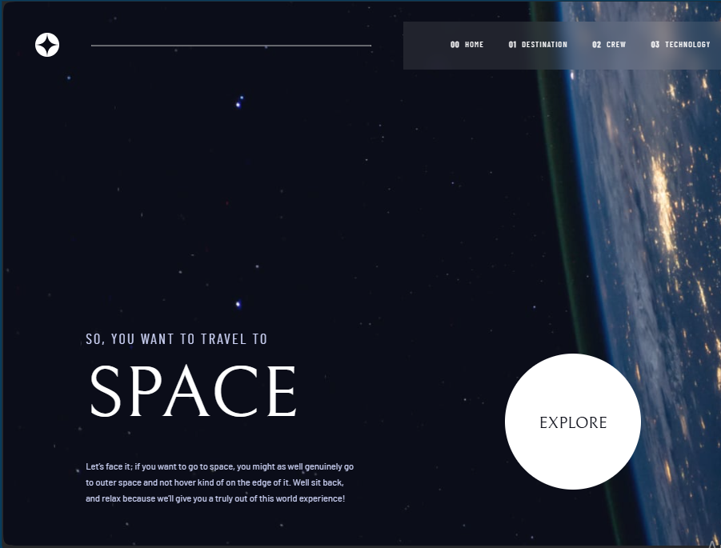
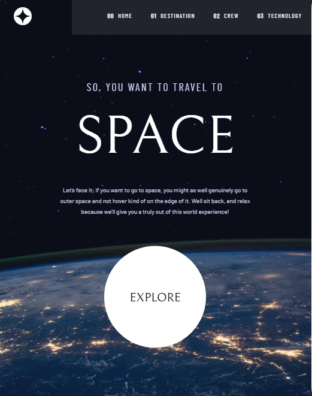
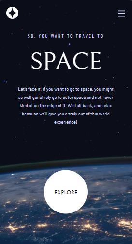
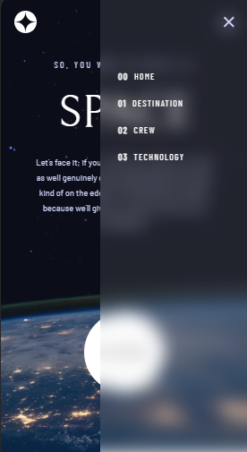
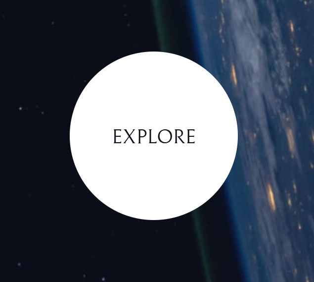
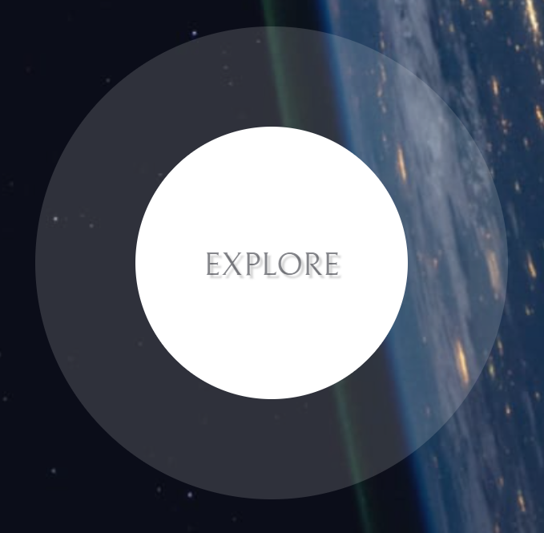

<h1 align="center">Space tourism</h1>

## Description

The project was completed as part of the Frontend Mentor Challenges program based on the Figma layout.
This is a multi-page website that describes a fantasy flight program, describes the flight route, the composition of the team and the technologies used.

## About the project.
- The markup is styled using the Sass preprocessor, using mixins and variables.
- The project implements smooth page opening, a pop-up menu in the mobile version and navigation by buttons inside HTML pages is done in JS.

## Adaptive design

The interface design is provided for various types of devices.

## **Desktop**

## **Tablet**

## **Mobile**

## **Pop-up menu**

## **Responsive web design**

## I invite you to see my other projects.
